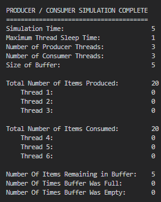
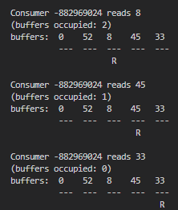

### Preview Output

<br>
### Preview Running Simulation

<hr>

### Features

- Multithreading

### Shortcomings

- Multithreading


# About this project


     


## The Buffer struct
<**buffer.h**>
```h
#define BUFFER_SIZE 5
typedef struct
{
    buffer_item *buffer[BUFFER_SIZE];
    int in;
    int out;
    int items_produced;
    int items_consumed;
    int times_buffer_was_empty;
    int times_buffer_was_full;
    sem_t full;
    sem_t empty;
    pthread_mutex_t mutex;
} Buffer;
```

## C Pthreads
<**osproj4.c**>
```c
#include "buffer.h"
#include <pthread.h>
#include <semaphore.h>
#define number_of_producers 1
#define number_of_consumers 1
int main(int argc, char *argv[])
{
    // get cmd line args
    simulation_time = atoi(argv[1]);
    max_thread_sleep = atoi(argv[2]);
    number_of_producers = atoi(argv[3]);
    number_of_consumers = atoi(argv[4]);
    showBufferState = strcmp(argv[5], "yes") == 0;

    pthread_mutex_init(&print_buffer_priv, NULL);

    Buffer myBuffer;              // declar a buffer
    buffer_initialize(&myBuffer); // initialize semaphores + mutex

    pthread_t tid_p[number_of_producers];
    pthread_t tid_c[number_of_consumers];
    pthread_attr_t attr;

    pthread_attr_init(&attr);

    for (int i = 0; i < number_of_producers; i++)
    {
        pthread_create(&tid_p[i], &attr, producer, (void *)&myBuffer);
    }
    for (int i = 0; i < number_of_consumers; i++)
    {
        pthread_create(&tid_c[i], &attr, consumer, (void *)&myBuffer);
    }

    // terminate all threads after N time
    sleep(simulation_time);
    for (int i = 0; i < number_of_producers; i++)
    {
        pthread_cancel(tid_p[i]);
    }
    for (int i = 0; i < number_of_consumers; i++)
    {
        pthread_cancel(tid_c[i]);
    }

    // join all threads back together
    for (int i = 0; i < number_of_producers; i++)
    {
        pthread_join(tid_p[i], NULL);
    }
    for (int i = 0; i < number_of_consumers; i++)
    {
        pthread_join(tid_c[i], NULL);
    }
}
```


Random math idk looks cool。

$$\(\sqrt{3x-1}+(1+x)^2\)$$
                    
$$\sin(\alpha)^{\theta}=\sum_{i=0}^{n}(x^i + \cos(f))$$
                
### End
