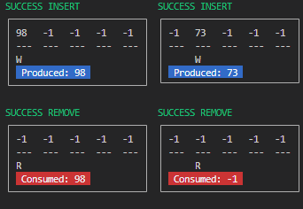

### Preview Output

<hr>

### Features

- Multithreading

### Shortcomings

- Multithreading


# About this project


     


#### The Buffer struct
buffer.
```h
#define BUFFER_SIZE 5
typedef struct
{
    int buffer[BUFFER_SIZE];
    int in;
    int out;
    sem_t full;
    sem_t empty;
    pthread_mutex_t mutex;
} Buffer;
```

#### C Pthreads
osproj4.c
```c
#include "buffer.h"
#include <pthread.h>
#include <semaphore.h>
#define number_of_producers 1
#define number_of_consumers 1
int main(int argc, char *argv[])
{
    Buffer myBuffer;
    buffer_initialize(&myBuffer); // semaphores + mutex

    pthread_t tid[number_of_producers];
    pthread_attr_t attr;
    pthread_attr_init(&attr);
    for (int i = 0; i < number_of_producers; i++)
    {
        pthread_create(&tid[i], &attr, producer, (void *)&myBuffer);
    }
    for (int i = 0; i < number_of_consumers; i++)
    {
        pthread_create(&tid[i], &attr, consumer, (void *)&myBuffer);
    }
    for (int i = 0; i < number_of_producers; i++)
    {
        pthread_join(tid[i], NULL);
    }
    for (int i = 0; i < number_of_consumers; i++)
    {
        pthread_join(tid[i], NULL);
    }
}
```


Random math idk looks cool。

$$\(\sqrt{3x-1}+(1+x)^2\)$$
                    
$$\sin(\alpha)^{\theta}=\sum_{i=0}^{n}(x^i + \cos(f))$$
                
### End
